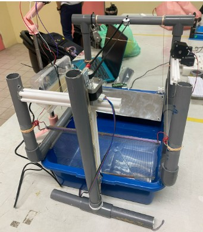
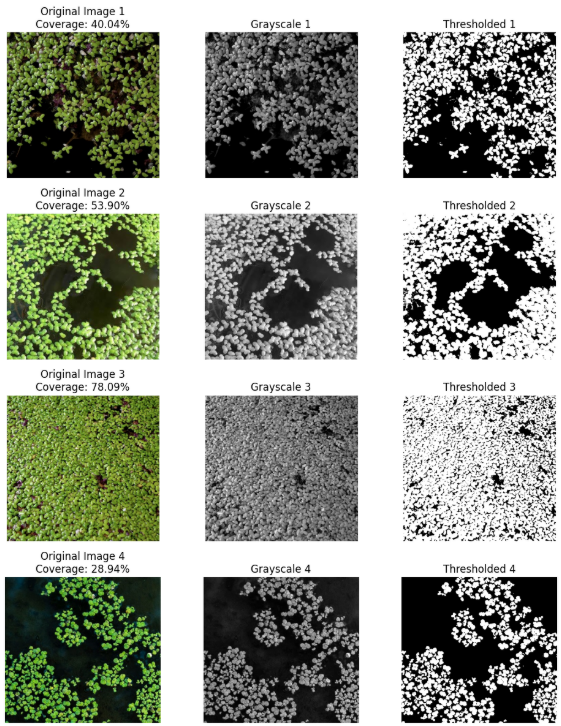
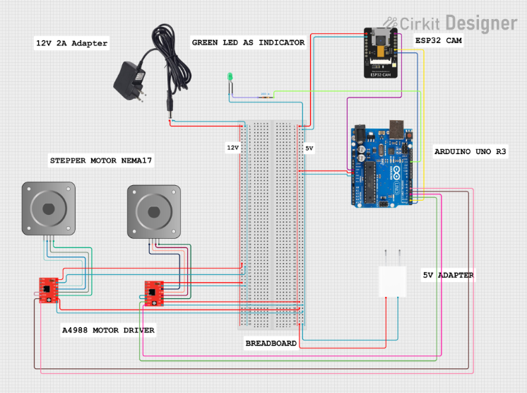
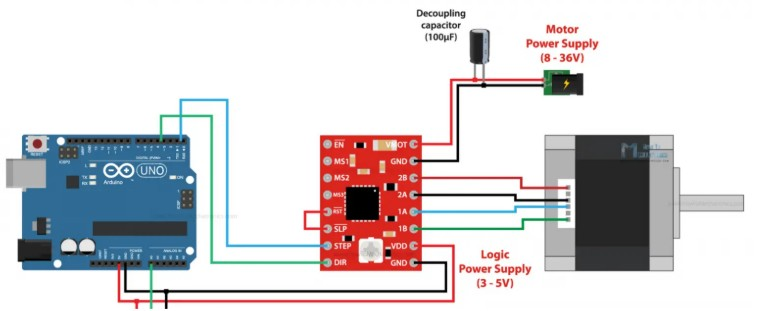
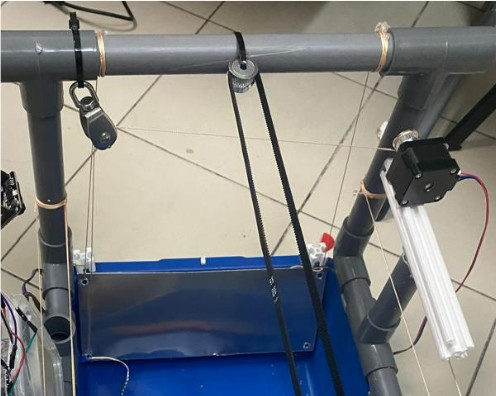
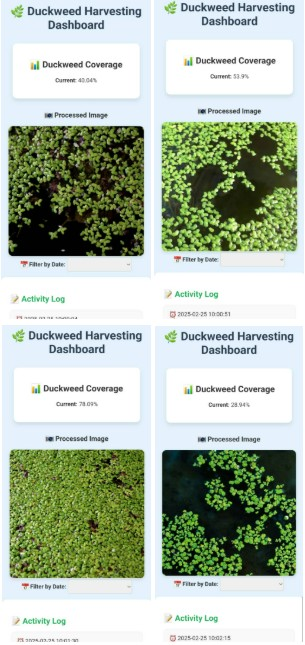

# 🌿 IoT Automated Duckweed Harvesting System

An IoT-based automated duckweed harvesting prototype that monitors duckweed coverage using an **ESP32-CAM** and automatically activates a motorized harvesting mechanism when the detected coverage reaches a predefined threshold.

The project combines **embedded systems, IoT communication, image processing, mechanical automation, Flask web development, and remote monitoring through PythonAnywhere**.

---

## 📌 Project Overview

Duckweed is a rapidly growing aquatic plant that can be useful as a source of nutrition for fish and livestock.

However, excessive duckweed growth can reduce oxygen levels, affect water quality, block water channels, and create management problems in aquaculture and agricultural environments.

Traditional duckweed harvesting requires repetitive manual work.

This project was developed to demonstrate how **IoT, automation, image processing, and web monitoring** can be combined to monitor duckweed growth and automatically operate a harvesting mechanism when coverage becomes too high.

---

## 📸 Prototype



---

## 🎯 Project Objectives

The system was designed to:

- Monitor duckweed coverage automatically
- Capture the water surface using an ESP32-CAM
- Estimate duckweed coverage using grayscale image thresholding
- Send monitoring data through Wi-Fi
- Display coverage information through a web dashboard
- Send coverage readings from the ESP32-CAM to an Arduino Uno
- Automatically activate the harvesting mechanism when the threshold is reached
- Reduce dependency on repetitive manual harvesting

---

# 🏗 System Architecture

```text
                       Water Surface
                            │
                            ▼
                       ESP32-CAM
                            │
                    Capture Image
                            │
                            ▼
                 Grayscale Processing
                            │
                            ▼
                  Calculate Coverage
                       /          \
                      /            \
                     ▼              ▼
              HTTP / JSON       Serial Data
                   │                │
                   ▼                ▼
             PythonAnywhere     Arduino Uno
                   │                │
                   ▼                ▼
           Flask Web Server   Harvest Controller
                   │                │
                   ▼        ┌───────┴───────┐
             Web Dashboard  ▼               ▼
                       A4988 Driver     A4988 Driver
                            │               │
                            ▼               ▼
                        Motor 1         Motor 2
                     Net Movement    Lifting Mechanism
```

---

# 🔄 System Workflow

1. The ESP32-CAM captures the water surface.
2. The captured image is processed in grayscale.
3. Pixel intensity thresholding is used to estimate duckweed coverage.
4. The calculated coverage is sent to the Flask web server using HTTP and JSON.
5. The Flask application records and displays the coverage information.
6. The ESP32-CAM also sends the calculated coverage to the Arduino Uno.
7. The Arduino checks whether the coverage has reached the configured harvesting threshold.
8. When the threshold is reached, the harvesting sequence begins automatically.
9. Motor 1 moves the harvesting net forward.
10. Motor 2 raises the lifting mechanism.
11. The system pauses to allow the duckweed to be collected.
12. Motor 2 lowers the lifting mechanism.
13. Motor 1 returns the harvesting mechanism to its original position.
14. The system resumes monitoring.

---

# 🛠 Technologies Used

## Embedded Systems

- Arduino Uno R3
- ESP32-CAM
- Arduino C/C++
- Serial Communication

## Hardware

- NEMA 17 Stepper Motors
- A4988 Stepper Motor Drivers
- LED Indicator
- Belt Mechanism
- Pulley System
- Stainless Steel Collection Mechanism
- 12V Power Supply
- 5V Power Supply

## IoT / Networking

- Wi-Fi
- HTTP
- JSON
- Device-to-server communication
- REST-style API communication

## Backend

- Python
- Flask
- Jinja2
- `pytz`

## Cloud / Web Deployment

- PythonAnywhere
- Flask Web Application
- Remote IoT Monitoring
- HTTP API
- JSON Data Transfer

## Frontend

- HTML
- CSS

## Image Processing

- ESP32-CAM
- Grayscale image processing
- Pixel intensity thresholding
- Coverage percentage calculation
- Google Colab for threshold testing

---

# 📷 Image Processing

The ESP32-CAM captures the water surface using a grayscale image format.

Each pixel has an intensity value.

During prototype development, several images were tested because lighting conditions affected the pixel intensity.

A threshold value was selected to estimate the percentage of the water surface covered by duckweed.

The coverage percentage is calculated as:

```text
                 Detected Pixels
Coverage (%) = ------------------- × 100
                   Total Pixels
```

The prototype used an image intensity threshold of:

```text
80
```

The result was then converted into a duckweed coverage percentage.



---

# ⚙️ Automatic Harvesting

The Arduino receives the calculated coverage percentage from the ESP32-CAM through serial communication.

The configured harvesting threshold used in the final Arduino code is:

```text
80%
```

When the coverage reaches or exceeds this threshold, the Arduino starts the harvesting sequence.

## Motor 1 — Net Movement

Motor 1 controls the forward and backward movement of the harvesting net.

Prototype movement:

```text
1100 steps
```

The motor moves the net forward to collect the duckweed and later returns the mechanism to its original position.

## Motor 2 — Lifting Mechanism

Motor 2 controls the lifting mechanism.

Prototype movement:

```text
500 steps
```

The lifting mechanism raises the collected duckweed, pauses for removal, and lowers back to its original position.

---

# 🔌 Circuit Design

The prototype integrates:

- Arduino Uno R3
- ESP32-CAM
- Two A4988 stepper motor drivers
- Two NEMA 17 stepper motors
- LED indicator
- External power supplies
- Breadboard and jumper wiring



---

# 🔧 Electrical Components

The system uses separate components for monitoring, control, motor movement, and power management.



---

# 🏗 Lifting Mechanism

The harvesting mechanism includes a pulley and lifting system used to raise the collected duckweed after Motor 1 pushes it toward the collection area.



---

# ☁️ Web Server & Deployment

The monitoring dashboard was developed using **Python Flask** and deployed using **PythonAnywhere** during prototype development.

The ESP32-CAM communicated with the Flask backend through HTTP requests and sent duckweed coverage information as JSON data.

The original PythonAnywhere deployment is no longer maintained.

A screenshot of the working dashboard is included in this repository.

## Deployment Stack

- Python
- Flask
- PythonAnywhere
- HTTP
- JSON
- HTML
- CSS
- Jinja2 Templates
- `pytz` for Malaysia timezone handling

## Server Responsibilities

The Flask application was responsible for:

- Receiving duckweed coverage from the ESP32-CAM
- Validating coverage values
- Recording monitoring activity
- Receiving processed images
- Displaying the latest duckweed coverage
- Displaying the latest uploaded image
- Showing timestamped activity logs

---

# 🌐 Web Monitoring Architecture

```text
ESP32-CAM
    │
    │ Wi-Fi
    ▼
HTTP Request
    │
    │ JSON
    ▼
PythonAnywhere
    │
    ▼
Flask Application
    │
    ├── /update
    │   └── Receive duckweed coverage
    │
    ├── /upload
    │   └── Receive processed image
    │
    └── /
        └── Monitoring Dashboard
            ├── Current Coverage
            ├── Recent Image
            └── Activity Log
```

---

# 🖥 Monitoring Dashboard

The web dashboard provided a simple interface for remotely monitoring the prototype.

It displayed:

- Current duckweed coverage
- Latest received image
- Timestamped coverage updates
- Image upload activity



---

# 🔗 Flask API Endpoints

The Flask server provides several routes used by the monitoring system.

## Dashboard

```http
GET /
```

Displays the monitoring dashboard.

---

## Update Coverage

```http
POST /update
```

Used by the ESP32-CAM to send the latest calculated coverage.

Example JSON payload:

```json
{
    "coverage": 75.42
}
```

The server validates the value before updating the current coverage.

Coverage values must be between:

```text
0 - 100
```

---

## Retrieve Coverage

```http
GET /update
```

Returns the latest duckweed coverage and activity information.

Example response:

```json
{
    "status": "success",
    "coverage": 75.42
}
```

---

## Upload Image

```http
POST /upload
```

Used to receive an image from the monitoring system.

The uploaded image is stored in:

```text
web-server/static/uploads/
```

---

# 📂 Project Structure

```text
iot-duckweed-harvester/
│
├── README.md
├── requirements.txt
├── .gitignore
│
├── arduino/
│   └── duckweed_harvester.ino
│
├── esp32-cam/
│   └── duckweed_monitor.ino
│
├── web-server/
│   ├── app.py
│   │
│   ├── templates/
│   │   └── dashboard.html
│   │
│   └── static/
│       ├── style.css
│       │
│       └── uploads/
│           └── .gitkeep
│
└── docs/
    ├── circuit-diagram.png
    ├── dashboard.jpg
    ├── electrical-components.jpg
    ├── image-processing.png
    ├── lifting-mechanism.jpg
    └── prototype.jpg
```

---

# 🚀 Running the Flask Dashboard Locally

## 1. Clone the Repository

```bash
git clone https://github.com/RainbowC9/iot-duckweed-harvester.git
```

---

## 2. Enter the Project Directory

```bash
cd iot-duckweed-harvester
```

---

## 3. Install Python Dependencies

```bash
pip install -r requirements.txt
```

The required Python packages are:

```text
Flask
pytz
```

---

## 4. Open the Web Server Directory

```bash
cd web-server
```

---

## 5. Run the Flask Application

```bash
python app.py
```

The local development server will normally be available at:

```text
http://127.0.0.1:5000
```

---

# 📡 ESP32-CAM Configuration

Before uploading the ESP32-CAM program, configure your local Wi-Fi credentials.

The public GitHub version intentionally uses placeholder values such as:

```cpp
const char *wifiList[][2] = {
    {"YOUR_WIFI_SSID_1", "YOUR_WIFI_PASSWORD_1"},
    {"YOUR_WIFI_SSID_2", "YOUR_WIFI_PASSWORD_2"}
};
```

You must also configure the server address:

```cpp
const char *serverUrl =
    "http://YOUR_SERVER_ADDRESS/update";
```

Replace this with the address of your own Flask deployment if you want to redeploy the system.

---

# 🔐 Security

Sensitive information has intentionally been excluded from this repository.

Do not commit:

```text
Wi-Fi passwords
API keys
Server passwords
Database passwords
Environment files
Authentication tokens
Private keys
```

The repository `.gitignore` excludes common configuration and credential files such as:

```text
.env
config.h
secrets.h
credentials.h
```

---

# 🚧 Challenges & Troubleshooting

Several technical challenges occurred during prototype development.

## 1. Short Circuit and Hardware Failure

During development, a short circuit caused hardware components to fail.
Troubleshooting included:
- Inspecting wiring connections
- Checking pin configurations
- Replacing the faulty breadboard
- Replacing damaged hardware
- Adjusting the power supply
- Testing individual components before reconnecting the complete system

---

## 2. Power Supply Management

The prototype initially experienced power-related issues.
The team adjusted the power setup and added protection measures to improve system stability and reduce the risk of component damage.

---

## 3. ESP32 Wi-Fi Connectivity

The ESP32-CAM experienced Wi-Fi connection problems during development.
Troubleshooting involved:
- Checking wiring
- Checking the power connection
- Testing direct ESP32 power connections
- Reconnecting to available Wi-Fi networks
- Implementing automatic Wi-Fi reconnection

---

## 4. Image Detection and Lighting

Image thresholding was affected by environmental lighting.
Several test images were used to compare:

```text
Original Image
      ↓
Grayscale Image
      ↓
Thresholded Image
```

This testing helped determine a more suitable threshold value for the prototype environment.

---

## 5. Mechanical Alignment

The harvesting mechanism required repeated adjustments to achieve smooth movement.

Testing included:

- Net alignment
- Rope tension
- Belt movement
- Pulley alignment
- Motor direction
- Step count adjustment
- Lifting mechanism positioning

---

# 💡 Skills Demonstrated

## Embedded Systems

- Arduino programming
- ESP32-CAM programming
- Stepper motor control
- A4988 motor driver integration
- Serial communication
- Hardware and software integration

## IoT / Networking

- Wi-Fi communication
- HTTP requests
- JSON data exchange
- IoT device-to-server communication
- Remote monitoring

## Web / Cloud

- Python Flask development
- PythonAnywhere deployment
- HTTP API handling
- Static file management
- Flask templates
- HTML
- CSS
- Jinja2

## Image Processing

- Grayscale processing
- Pixel intensity thresholding
- Coverage calculation
- Image testing using Google Colab

## Troubleshooting

- Hardware troubleshooting
- Wiring troubleshooting
- Power supply troubleshooting
- Wi-Fi troubleshooting
- Server communication troubleshooting
- Mechanical testing
- Component integration

## Engineering

- System integration
- Prototype development
- Automation
- Technical documentation
- Testing and debugging
- Team collaboration

---

# 🔮 Possible Future Improvements

The prototype could be improved further by adding:

- Machine-learning-based duckweed detection
- More reliable image segmentation
- Improved handling of different lighting conditions
- Database storage for historical monitoring
- Historical coverage charts
- User authentication
- Mobile notifications
- Automatic harvesting alerts
- Remote manual motor control
- HTTPS communication
- Device authentication
- Environmental sensors
- Cloud-hosted database
- More robust error handling
- Solar-powered operation
- Larger-scale harvesting mechanism

---

# 🎓 Academic Project

This project was developed as part of the **KS43503 Smart Technology** course at the **Faculty of Engineering, Universiti Malaysia Sabah**.
The project demonstrated the integration of IoT technology, embedded systems, image processing, mechanical automation, and remote monitoring for automated duckweed management.

---

# 👥 Team Project

This project was developed collaboratively as a four-member university project.
This repository presents a cleaned and portfolio-safe version of the technical implementation.
Sensitive credentials and unnecessary personally identifiable academic information have been excluded.

---

# ⚠️ Prototype Disclaimer

This system was developed as an academic engineering prototype for controlled testing.
It should not be considered a production-ready agricultural or aquaculture harvesting system without further safety testing, environmental testing, mechanical refinement, and system hardening.

---

# 👩‍💻 Author

**Grace Evelyn**
